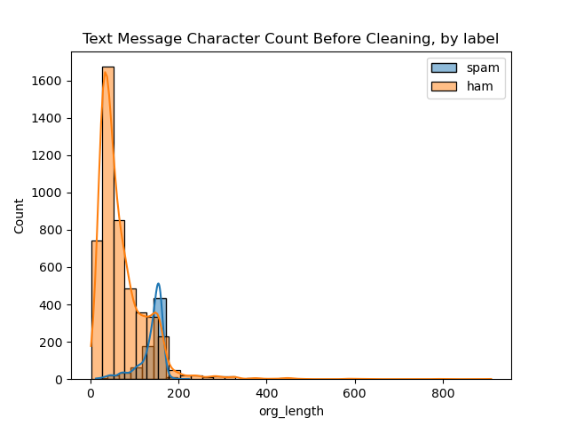
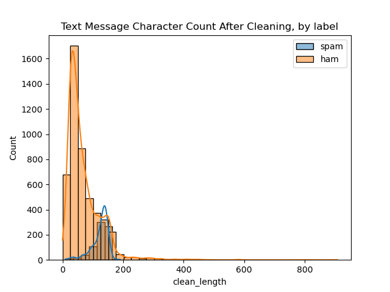
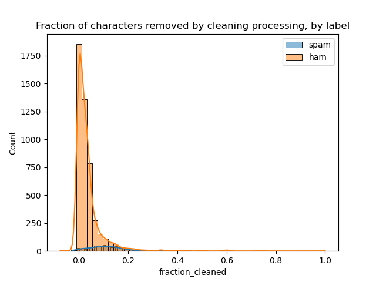
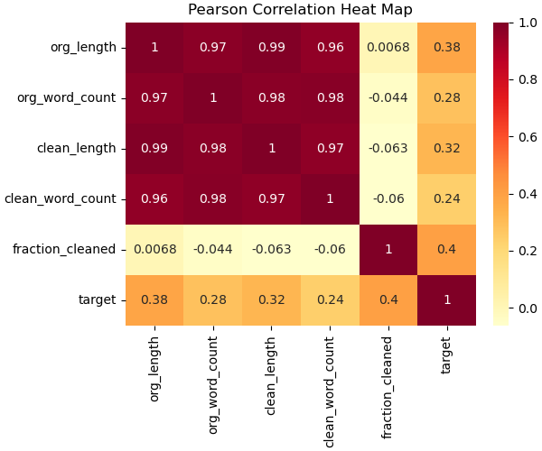

# Project: Ham vs. Spam (Text Classification)

## Overview
In this project you will build a machine learning model that predicts whether a text message is **ham** (normal) or **spam** (unwanted/advertising/scam). This is one of the most common “real world” classification problems and is a great way to practice the full data science workflow.

You will work with a labeled dataset of SMS messages and train a model using features created from text (for example: **bag-of-words** or **TF–IDF**).

---

## Learning Goals
By the end of this project, you should be able to:

- Load and explore a real dataset with text + labels
- Clean and preprocess text (basic normalization)
- Convert text to numerical features with **CountVectorizer** or **TfidfVectorizer**
- Train at least one classification model (baseline + improved)
- Evaluate with a **confusion matrix**, **precision**, **recall**, **F1**, and optionally an ROC curve
- Explain tradeoffs (false positives vs. false negatives) in a spam filter

---

## Dataset
We will use the **[SMS Spam Collection** dataset](https://www.kaggle.com/datasets/uciml/sms-spam-collection-dataset/data) (ham/spam labeled messages).

- Each row is a text message with a label: `ham` or `spam`
- You’ll treat `spam` as the “positive” class

What you will submit:
- A Colab notebook with your code, outputs, and written interpretation
- Clear evaluation and discussion of results
- A short “recommendation” at the end: what model would you use and why?

---

## Exploratory Data Analysis (EDA)

- The datafile required some cleanup due to formatting issues. The 5572 observations in the file break down into two classes:

| label | count | percent | 
| ----- | :---: | :-----: |
| ham   | 4825  | 86.6    | 
| spam  | 747   | 13.4    | 

- The cleaning strategy for language processing consisted of:
	1. Lowercase
	2. Standalone numbers while keeping alphanumeric ‘words’ used in text message shorthand: 1st, h8, l8r
	3. Selective removal of punctuation: ().?!\/<>$%”
	4. HTML text tags, ex: \&nbsp;
	5. Normalize unicode accent marks to ASCII

---

**Ham Sample Texts after cleaning:**

- 1apple day=no doctor  1tulsi leaf day=no cancer  1lemon day=no fat  1cup milk day=no bone problms litres watr day=no diseases snd ths whom u care  :-
- aiyo    her lesson so early    I’m still sleepin, haha    okie, u go home liao den confirm w me lor
- fine I miss you very much
- yup
- as per your request ‘melle melle  oru minnaminunginte nurungu vettam ‘ has been set as your callertune for all callers  press  to copy your friends callertune

**Spam Sample Texts after cleaning:**

- your b4u voucher w c is marsms  log onto www b4utele com for discount credit  to opt out reply stop  customer care call
- money    you r a lucky winner   claim your prize text money over a1million to give away   ppt150x3+normal text rate box403 w1t1jy
- u have a secret admirer who is looking make contact with u-find out who they r*reveal who thinks ur so special-call on stopsms
- double mins and txts 6months free bluetooth on orange  available on sony, nokia motorola phones  call mobileupd8 on or call2optout n9dx
- xmas iscoming and ur awarded either a cd gift vouchers and free entry r a weekly draw txt music to tnc

---

### Descriptive Stats

**Full Corpus**

|      |   org length |   org word_count |   clean length |   clean word count |   fraction cleaned |
|:-----|-------------:|-----------------:|---------------:|-------------------:|-------------------:|
| mean |      80.6 |          15.7 |        77.0 |            17.3 |          0.044 |
| std  |      60.0 |          11.5 |        57.4 |            13.2 |          0.066 |
| min  |       2      |           1      |         0      |             1      |         -0.075 |
| max  |     910      |         171      |       908      |           193      |          1         |

**Ham only**

|      |   org length |   org word_count |   clean length |   clean word count |   fraction cleaned |
|:-----|-------------:|-----------------:|---------------:|-------------------:|-------------------:|
| mean |      71.6 |          14.4 |        69.7 |            16.1 |          0.034 |
| std  |      58.4 |          11.6 |        57.3 |            13.6 |          0.059 |
| min  |       2      |           1      |         0      |             1      |         -0.075 |
| max  |     910      |         171      |       908      |           193      |          1         |

**Spam only**

|      |   org length |   org word_count |   clean length |   clean word count |   fraction cleaned |
|:-----|-------------:|-----------------:|---------------:|-------------------:|-------------------:|
| mean |     139.1  |         23.9  |        124.1 |           25.3  |          0.112  |
| std  |      29.0 |          5.8 |         28.1 |            6.3 |          0.073 |
| min  |      13      |          2       |          9     |            1       |         -0.026 |
| max  |     224      |         35       |        191     |           40       |          0.457  |

---

### Text Analysis

**Top 20 Words in corpus after cleaning and stop words removed (occurrence/message)**

|   rank in corpus | word   |   frequency in corpus |
|:----------------:|:-------|----------------------:|
|                1 | ur     |             0.070 |
|                2 | just   |             0.067 |
|                3 | ok     |             0.053 |
|                4 | free   |             0.051 |
|                5 | ll     |             0.047 |
|                6 | know   |             0.047 |
|                7 | good   |             0.044 |
|                8 | like   |             0.044 |
|                9 | got    |             0.043 |
|               10 | come   |             0.042 |
|               11 | day    |             0.041 |
|               12 | time   |             0.040 |
|               13 | love   |             0.039 |
|               14 | send   |             0.036 |
|               15 | want   |             0.035 |
|               16 | text   |             0.035 |
|               17 | txt    |             0.032 |
|               18 | going  |             0.031 |
|               19 | need   |             0.030 |
|               20 | home   |             0.030 |

**Top 20 Words - Spam messages (occurrence/message)**

| spam rank  | word   |  spam frequency |   ham rank |   ham frequency |   corpus rank |    corpus frequency |   spam/ham |
|---:|-------:|:-------|---------------------:|----------------------:|-----------------:|------------------:|-----------:|
| 1 | free    | 0.300  |                   79 |               0.012   |                4 |             0.051 |   24.1  |
| 2 | txt     | 0.218  |                  441 |               0.003   |               17 |             0.032 |   75.2  |
| 3 | ur      | 0.193  |                    4 |               0.051   |                1 |             0.070 |    3.8  |
| 4 | mobile  | 0.170  |                  417 |               0.003   |               29 |             0.025 |   54.7  |
| 5 | text    | 0.167  |                   64 |               0.014   |               16 |             0.035 |   11.9  |
| 6 | stop    | 0.165  |                  141 |               0.008   |               23 |             0.029 |   21.5  |
| 7 | claim   | 0.151  |                  nan |               nan     |               45 |             0.020 |  nan    |
| 8 | reply   | 0.139  |                  116 |               0.009   |               28 |             0.027 |   15.3  |
| 9 | www     | 0.131  |                 2449 |               0.000   |               54 |             0.018 |  316.5  |
| 10 | prize  | 0.124  |                  nan |               nan     |               61 |             0.017 |  nan    |
| 11 | just   | 0.106  |                    1 |               0.061   |                2 |             0.067 |    1.7  |
| 12 | cash   | 0.102  |                  495 |               0.002   |               65 |             0.016 |   40.9  |
| 13 | won    | 0.102  |                  323 |               0.003   |               58 |             0.017 |   25.8  |
| 14 | uk     | 0.099  |                 3890 |               0.000   |               79 |             0.013 |  478.0  |
| 15 | send   | 0.095  |                   25 |               0.027   |               14 |             0.036 |    3.6  |
| 16 | 150p   | 0.095  |                  nan |               nan     |               85 |             0.013 |  nan    |
| 17 | new    | 0.092  |                   66 |               0.014   |               32 |             0.024 |    6.7  |
| 18 | nokia  | 0.090  |                 1599 |               0.001   |               86 |             0.013 |  144.3  |
| 19 | win    | 0.086  |                  516 |               0.002   |               77 |             0.014 |   34.4  |
| 20 | urgent | 0.084  |                  794 |               0.001   |               87 |             0.013 |   58.1  |

---

### Takeaway

- The dataset appears to originate from the UK. These text messages contain a high amount of vernacular and shorthands that will generate noise columns in vectorization and evade stopwords.
- The data set contains ~5500 entries with 13.4% marked as spam.
- Average message length (before cleaning) for spam is nearly double of ham messages, 139 vs. 72.
- Average word counts after cleaning were 25 vs. 16 for spam and ham, respectively.
- Message length has a correlation of 0.38 to the target column.
- The top 5 words in the spam dataset were: free, txt, ur, mobile, text.
- Ratio of word occurrence in spam messages vs. ham messages was measured. These words exceed 100x occurrence in spam messages:
	- uk www code award nokia delivery club await games private services video landline statement voucher

---

## Data Modeling

- In developing this spam filter, maximizing precision scores is the highest priority to minimize false positives. Containing (or fully blocking) false positives will lead to user frustration. False negatives can be combatted with an easy accessible 'move to junk' UI element, which should be used as feedback in the model for continuous improvement - or less ideally, manual white listing.

- In evaluating models, I will use the following hierarchy:
    1. Precision (test set), goal > 0.99 (1 false positive occurs for every 99 spam messages)
    2. Recall (test set), goal > 0.80 (correctly identifies 80% of true spam messages)
    3. Overfitting, as measured by comparing F1 Score on the test and train sets.
    4. Accuracy (test set) is included but is less useful due to unbalanced class sizes.

---

### Dummy Classifier

- Three strategies were utilized from Dummy Classifier. Most Frequent always picks the majority class (86.6% ham).  Stratified is random guessing based on the class sizes. Uniform is completely random guessing.

- All tests performed poorly on precision and recall scores on the minority 'spam' class.

| Model Args      | Precision | Recall | F1 Score | Accuracy |
| ------------- | :-------: | :----: | :------: | :------: |
| strategy='most_frequent'     | 0.000 | 0.000 | 0.000 | 0.866 |
| strategy='uniform'           | 0.126 | 0.465 | 0.198 | 0.494 |
| strategy='stratified'        | 0.138 | 0.144 | 0.141 | 0.764 |

<i>Raw scores from strategy skew on Dummy Classifier.</i>

---

### Decision Tree

- I utilized a skew across max_depth parameter to vary the number of nodes on the decision tree.

- Precision was >0.9 for all tests. Recall was >0.8 and F1 score >0.85 when the max_depth >=20.

- Overfitting was rampant in all runs, but was <1.0 when max_depth <=20. Max Depth of 20 stikes the best balance on this model
 
- Inspecting the nodes of the decision tree, org_length (the character count of the unprocessed text) is typically the first node. The rest of the tree is composed of vectorized words. Thirteen of the top 20 spam words were visible in one run of the tree.

 | Model Args       | Precision | Recall | F1 Score | Accuracy | Train - F1 Score |
 | --------------- | :-------: | :----: | :------: | :------: | :--------------: |
 | max_depth=None     | 0.932 | 0.807 | 0.865 | 0.966 | 1.000 | 
 | max_depth=100      | 0.927 | 0.813 | 0.866 | 0.966 | 1.000 | 
 | max_depth=50       | 0.916 | 0.813 | 0.861 | 0.965 | 1.000 | 
 | **max_depth=20**   | 0.938 | 0.802 | 0.865 | 0.966 | 0.947 | 
 | max_depth=10       | 0.924 | 0.652 | 0.765 | 0.946 | 0.857 | 
 | max_depth=5        | 0.913 | 0.503 | 0.648 | 0.927 | 0.704 | 

<i>Raw scores from parameter skew on Decision Tree. Bold indicates selected model.</i>

---

### Logistic Regression

- I verified that a Logistic Regression with balanced weights outperformed the default model due to the unequal class sizes.

| Model Args       | Precision | Recall | F1 Score | Accuracy | Train - F1 Score |
| --------------- | :-------: | :----: | :------: | :------: | :--------------: |
| class_weight=None            | 0.994 | 0.824 | 0.901 | 0.976 | 0.984 | 
| **class_weight='balanced'**      | 0.965 | 0.888 | 0.925 | 0.981 | 0.996 |

<i>Raw scores from class_weight skew on Logistic Regression. Bold indicates selected model.</i>

- I utilized a skew on the regularization parameter, C. While precision scores increased monotonically with C, overfitting does as well and the train F1 score was maxed when C > 1. Recall was ~0.88, stable across the entire parameter range. C=0.5 was selected to balanced precision and overfitting concerns.

- Looking through the top 20 features, only 11 of the top 20 spam words appear and character length was not included. While character length was Z-scaled, the vectorized word columns triggered a warning when attempting standard scaling due to sparse data, so the raw word counts were used, limiting comparison of the the coefficients

 | Model Args       | Precision | Recall | F1 Score | Accuracy | Train - F1 Score |
 | --------------- | :-------: | :----: | :------: | :------: | :--------------: |
 | C=0.01, class_weight='balanced'              | 0.717 | 0.882 | 0.791 | 0.938 | 0.787 | 
 | C=0.1, class_weight='balanced'               | 0.901 | 0.877 | 0.889 | 0.971 | 0.947 | 
 | **C=0.5, class_weight='balanced'**           | 0.960 | 0.893 | 0.925 | 0.981 | 0.989 | 
 | C=1, class_weight='balanced'                 | 0.965 | 0.888 | 0.925 | 0.981 | 0.996 | 
 | C=10, class_weight='balanced'                | 0.977 | 0.893 | 0.933 | 0.983 | 1.000 | 
 | C=100, class_weight='balanced'               | 0.982 | 0.882 | 0.930 | 0.982 | 1.000 | 
 | C=1000, class_weight='balanced'              | 0.994 | 0.882 | 0.935 | 0.983 | 1.000 | 

<i>Raw scores from parameter skew on Logistic Regression. Bold indicates selected model.</i>

---

### Takeaway
- Both decision tree and logistic regression handily outperformed the dummy classifier baseline.
- Logistic Regression (LR) shows a small improvement in precision over Decision Tree (DT) and a significant advantage for recall.
- In order to better quantify model performance, I did a 5x test of each model with their optimized parameters as a test of model stability and collected stats. All random_state args were removed.
    - LR performed ~1 sigma better on precision and ~4 sigma better on recall.
    - This model stability method is taking different train-test splits of the same dataset and ultimately, model performance will be determined by testing on a new dataset.

 | Model           | Precision *(>0.99)* | Recall *(>0.8)* | F1 Score | Accuracy | Train - F1 Score |
 | --------------- | :-------: | :----: | :------: | :------: | :--------------: |
 | DecisionTree (20) | 0.921 +/- 0.013 | **0.820 +/- 0.023** | 0.868 +/- 0.015 | 0.966 +/- 0.004 | 0.944 +/- 0.005 | 
 | LogisticRegression (0.5, balanced) | 0.931 +/- 0.011 | **0.912 +/- 0.021** | 0.922 +/- 0.012 | 0.979 +/- 0.003 | 0.991 +/- 0.001 | 

<i>Mean +/- stdev after 5 random Test-Train-Split runs. Bold indicates meeting success criteria (precision > 0.99, recall > 0.8).</i>

- Both tests fell short of the precision goal of 0.99 (1 false positive occurs for every 99 spam messages). With a precision of 0.943, one would expect 1 false positive for every 15 spam messages successfully filtered - which is likely to lead to a lot of user frustration. I would not deploy either model in their current state.
- In the third notebook, I will explore pre-processing options, as well as ensemble methods.

---
## Optimization

- Utilizing the two baseline models, I performed several tests on text vectorization transformer using 5-fold cross validation on the training set. 
    - Enabling bi- and tri-grams using n_grams provided a minor improvement on precision. Precision improved from 0.918 to 0.94 - slightly better than 0.5-sigma.
    - TF-IDF vectorization performed slightly worse on decision tree and significantly worse on logistic regression. Enabling stop_words on TF-IDF further degraded performance.
    - As a negative control, I disabled stop words and found that decision tree performed slightly worse but logistic regression slightly improved - both well less than 1-sigma of effect. Going a step further, removing the text cleaning and reverting to the original text column lead to improvement on the logistic regression of 0.7-sigma. This is surprising and if I had to guess, is due to the sloppy mix of vernacular, shorthand, and typos in the corpus and I do not think this would lead to improvement in other datasets.
    - Utilizing n_grams does not trigger any new entries in the top 50 word lists (corpus nor spam), but n_grams have appeared in the top features for our baseline models: free sms, free wan help, just text, fraction cost reply, new message, message waiting, place send free

| Vectorization Strategy | Decision Tree (20) | Logistic Regression (0.5, balanced) |
| ---------------------- | :----------------: | :---------------------------------: |
| Baseline               | 0.918 +/- 0.028    | 0.925 +/- 0.034                     |
| n_grams(1,2)           | 0.939 +/- 0.026    | 0.940 +/- 0.034                     |
| **n_grams(1,3)**       | 0.940 +/- 0.021    | 0.945 +/- 0.033                     |
| TF-IDF (w/o stop words)| 0.903 +/- 0.019    | 0.805 +/- 0.036                     |
| TF-IDF (w/  stop words)| 0.900 +/- 0.025    | 0.758 +/- 0.036                     |
| Disable Stopwords      | 0.907 +/- 0.012    | 0.931 +/- 0.029                     |
| Skip Text Cleaning     | 0.915 +/- 0.017    | 0.948 +/- 0.024                     |

<i>Mean +/- stdev after 5-fold cross validation on training set. Bold indicates selected method.</i>

---

### Ensemble Models

- After incorporating tri-grams into my standard pipeline, I selected several ensemble methods representing both bagging and boosting strategies.
    - Random Forest performed perfectly for precision, but was among one of the worst performers for recall.
    - K-nearest neighbors had the 2nd best score for precision, but was unacceptably bad for recall.
    - Gradient Boosting and XGBoost both performed well. Without optimization, gradient boost outperformed on precision at the expense of recall, while XGBoost was more balanced between the two scores.
    - I did a quick round of hyperparameter tuning on the top two models but could not significantly improve either model.

 | Model Args           | Precision       | Recall          | F1 Score        | Accuracy        | Train - F1 Score|
 | -------------------- | :-------------: | :-------------: | :-------------: | :-------------: | :-------------: |
 | AdaBoostClassifier   | 0.948 +/- 0.017 | 0.856 +/- 0.027 | 0.899 +/- 0.019 | 0.974 +/- 0.005 | 1.000 +/- 0.000 | 
 | BaggingClassifier    | 0.938 +/- 0.013 | 0.793 +/- 0.022 | 0.859 +/- 0.016 | 0.965 +/- 0.004 | 0.951 +/- 0.005 | 
 | DecisionTree         | 0.933 +/- 0.016 | 0.802 +/- 0.008 | 0.863 +/- 0.010 | 0.966 +/- 0.003 | 0.949 +/- 0.003 | 
 | **GradientBoosting** | 0.971 +/- 0.008 | 0.743 +/- 0.026 | 0.842 +/- 0.019 | 0.963 +/- 0.004 | 0.927 +/- 0.005 | 
 | KNeighbors           | 0.977 +/- 0.032 | 0.275 +/- 0.022 | 0.429 +/- 0.029 | 0.902 +/- 0.004 | 0.554 +/- 0.018 | 
 | LogisticRegression   | 0.955 +/- 0.010 | 0.866 +/- 0.015 | 0.909 +/- 0.006 | 0.977 +/- 0.001 | 0.997 +/- 0.001 | 
 | **RandomForest**     | 1.000 +/- 0.000 | 0.725 +/- 0.022 | 0.841 +/- 0.015 | 0.963 +/- 0.003 | 1.000 +/- 0.000 | 
 | XGBClassifier        | 0.960 +/- 0.012 | 0.822 +/- 0.020 | 0.886 +/- 0.010 | 0.972 +/- 0.002 | 0.964 +/- 0.006 | 
 

<i>Mean +/- stdev after 5 random Test-Train-Split runs. Bold indicates selected models.</i>

| Model Args                                                       | Precision | Recall | F1 Score | Accuracy | Train - F1 Score |
| ---------------------------------------------------------------- | :-------: | :----: | :------: | :------: | :--------------: |
| RandomForestClassifier(n_estimators=250)                         | 1.000     | 0.754  | 0.860    | 0.967    | 1.000            | 
| **RandomForestClassifier(max_depth=100, n_estimators=250)**      | 1.000 | 0.706 | 0.828 | 0.961 | 0.984 | 
| RandomForestClassifier(max_depth=75, n_estimators=250)           | 1.000 | 0.706 | 0.828 | 0.961 | 0.948 | 
| RandomForestClassifier(max_depth=50, n_estimators=250)           | 1.000 | 0.647 | 0.786 | 0.953 | 0.889 | 
| RandomForestClassifier(max_depth=25, n_estimators=250)           | 1.000 | 0.374 | 0.545 | 0.916 | 0.675 | 
| RandomForestClassifier(max_depth=20, n_estimators=250)           | 1.000 | 0.299 | 0.461 | 0.906 | 0.566 | 
| RandomForestClassifier(max_depth=15, n_estimators=250)           | 1.000 | 0.166 | 0.284 | 0.888 | 0.341 |

<i>Raw scores from parameter skew on Random Forest. Bold indicates selected model.</i>

| Model Args           | Precision       | Recall          | F1 Score        | Accuracy        | Train - F1 Score|
| -------------------- | :-------------: | :-------------: | :-------------: | :-------------: | :-------------: |
| GradientBoostingClassifier(max_depth=50, n_estimators=250)       | 0.938 | 0.807 | 0.868 | 0.967 | 1.000 | 
| GradientBoostingClassifier(max_depth=25, n_estimators=250)       | 0.940 | 0.834 | 0.884 | 0.971 | 1.000 | 
| GradientBoostingClassifier(max_depth=20, n_estimators=250)       | 0.940 | 0.840 | 0.887 | 0.971 | 1.000 | 
| **GradientBoostingClassifier(max_depth=15, n_estimators=250)**   | 0.940 | 0.840 | 0.887 | 0.971 | 1.000 | 
| GradientBoostingClassifier(max_depth=10, n_estimators=250)       | 0.951 | 0.834 | 0.889 | 0.972 | 1.000 | 

<i>Raw scores from parameter skew on GradientBoosting. Bold indicates selected model.</i>

---

### Takeaway

- I performed a final model stability test on our baseline and leading models. Random Forest recall performance was still middling. I returned to vectorization parameters and found that turning off n_grams significantly improved recall on random forest - by ~4-sigma.
- In its final form, random forest is performing with a precision score of 0.996 - just one false positive for every 249 true positives - while recall performance is also meeting goal with 82.4% of spam messages being flagged. While some spam messages will go through, this can be somewhat mitigated by UI design.
- The finding that the original text outperforms cleaned text shows that there is still work to be done in cleaning the text, especially since when the corpus is so messy with abbreviations and typos.

 | Vectorize | Model    | Args           | Precision *(>0.99)* | Recall *(>0.8)* | F1 Score | Accuracy | Train - F1 Score |
 | --------- | -------- | -------------- | :-------: | :----: | :------: | :------: | :--------------: |
 | Trigrams | DecisionTree | max_depth=20 | 0.920 +/- 0.018 | **0.811 +/- 0.020** | 0.862 +/- 0.013 | 0.965 +/- 0.003 | 0.949 +/- 0.004 | 
 | Trigrams | GradientBoosting | max_depth=20 | 0.950 +/- 0.010 | **0.842 +/- 0.020** | 0.893 +/- 0.009 | 0.973 +/- 0.002 | 1.000 +/- 0.000 | 
 | Trigrams | LogisticRegression | C=0.5, 'balanced' | 0.952 +/- 0.015 | **0.879 +/- 0.013** | 0.914 +/- 0.010 | 0.978 +/- 0.003 | 0.997 +/- 0.001 | 
 | Trigrams | RandomForest | max_depth=100 | **0.999 +/- 0.005** | 0.740 +/- 0.025 | 0.850 +/- 0.018 | 0.965 +/- 0.004 | 0.983 +/- 0.003 | 
 | Unigrams | DecisionTree | max_depth=20 | 0.929 +/- 0.026 | **0.819 +/- 0.025** | 0.870 +/- 0.017 | 0.967 +/- 0.004 | 0.944 +/- 0.004 | 
 | Unigrams | GradientBoosting | max_depth=20 | 0.972 +/- 0.012 | **0.852 +/- 0.027** | 0.908 +/- 0.015 | 0.977 +/- 0.004 | 1.000 +/- 0.000 | 
 | Unigrams | LogisticRegression | C=0.5, 'balanced' | 0.944 +/- 0.019 | **0.901 +/- 0.019** | 0.921 +/- 0.016 | 0.979 +/- 0.004 | 0.990 +/- 0.002 | 
 | Unigrams | **RandomForest** | **max_depth=100** | **0.996 +/- 0.005** | **0.824 +/- 0.026** | 0.902 +/- 0.016 | 0.976 +/- 0.004 | 0.996 +/- 0.001 | 
 

<i>Mean +/- stdev after 5 random Test-Train-Split runs. Bold indicates meeting success criteria (precision > 0.99, recall > 0.8).</i>

-ROC curves for the four optimized models with unigram preprocessing. While Logistic Regression has a larger AUC, the prioritization of precision makes Random Forest the winning model, ie, the highest trace at x=0.

---

## Cleaning Improvements

After the project was submitted, I wanted to dig deeper into cleaning methods, which I identified as the limiting factor in further improving the model. I turned to ChatGPT for recommendations. 

Prompt: This is a library of text messages from early 2000s UK. It contains a high degree of slang, vernacular, abbreviations, shorthand, and typos. Suggest a cleaning strategy prior to tokenization. Examples include "in 2 a wkly comp" to "into a weekly competition", "dun" to "don't", and "receivea" to "receive a"
> Below is a practical, NLP-oriented cleaning strategy tailored to early-2000s UK SMS text, where slang, phonetic spellings, abbreviations, and typos are signal, not just noise. The goal is to normalize enough to help tokenization and modeling, without destroying linguistic cues (especially important if this is for spam/ham classification).
>
> Stage 1: Minimal Structural Normalization (Safe): lowercase, whitespace, unicode, punctuation
>
> Stage 2: SMS-Specific Normalization (High Impact): abbreviation expansion, dictionary to translate phonetic spellings
>
> Stage 3: Typo & Run-On Word Handling: run-on words, conservative spell correction
>
> Stage 4: Number & Symbol Normalization (Context-Aware)
>
>Stage 5: Tokenization Strategy (Post-Cleaning): TF-IDF on normalized text + original text often outperforms either alone <b>* Key Insight *</b>
>
> What NOT to Do: Remove slang entirely, Use generic spellcheckers, Over-normalize numbers and abbreviations, Strip casing or punctuation that may signal spam (!!!, £££)

The key insight for me (which ChatGPT even labeled 'key insight') was the best practice of sending data to the model in the format of *original text | cleaned text* to capture both the style of text as well as meaning. This helps explain my finding that the original text outperformed my cleaned text.

---

- I proceeded with two tests: 
	1. The full recommendation by ChatGPT
	2. A hybrid method of my original cleaning function outputting a combined column of the original text and cleaned text, fed into TF-IDF.
- I performed a quick parameter optimization for the new strategies, then utilized the 5x model stability test to compare to my earlier results.
- The hybrid method did not significantly increase precision scores, but it did boost recall scores on decision tree and logistic regression.
- The ChatGPT recommendation was successful in boosted precision and recall scores across all models.
    - Random Forest (max_depth=50) was the best model with 0.993 precision and 0.911 recall.
    - Logistic Regression (balanced, 10) had a precision score of 0.987 and recall of 0.951 - which was just short of the success criteria for precision.
    - Putting the random forest and logistic regression models together in a soft voting classifier outperformed both, with precision score of 0.995 (1 false positive for every 199 true positives) and recall score of 0.929. Overall, the F1 score was 0.961.
    - ChatGPT recommended a linear classifiers - either logistic regression or Support Vector Classification. After testing parameters, SVC(linear, 1) was the top performing single model.

 | Preprocess Strategy | Model                | Precision *(>0.99)* | Recall *(>0.8)* | F1 Score        | Accuracy        | Train - F1 Score |
 | --------- | ------------------------------ | :-------------: | :-------------: | :-------------: | :-------------: | :-------------: |
 | Class   | DecisionTree(20)                 | 0.929 +/- 0.026 | **0.819 +/- 0.025** | 0.870 +/- 0.017 | 0.967 +/- 0.004 | 0.944 +/- 0.004 | 
 | Hybrid  | DecisionTree(20)                 | 0.927 +/- 0.021 | **0.840 +/- 0.013** | 0.881 +/- 0.010 | 0.970 +/- 0.003 | 0.974 +/- 0.011 | 
 | ChatGPT | DecisionTree(20)                 | 0.943 +/- 0.031 | **0.899 +/- 0.033** | 0.921 +/- 0.028 | 0.979 +/- 0.007 | 0.991 +/- 0.004 |
 |         |                                  |                 |                 |                 |                 |                 |
 | Class   | LogisticRegression(balanced, 0.5)| 0.944 +/- 0.019 | **0.901 +/- 0.019** | 0.921 +/- 0.016 | 0.979 +/- 0.004 | 0.990 +/- 0.002 | 
 | Hybrid  | LogisticRegression(balanced, 10) | 0.962 +/- 0.010 | **0.942 +/- 0.007** | 0.952 +/- 0.006 | 0.987 +/- 0.002 | 0.995 +/- 0.001 | 
 | ChatGPT | LogisticRegression(balanced, 10) | 0.987 +/- 0.012 | **0.951 +/- 0.012** | 0.968 +/- 0.010 | 0.992 +/- 0.003 | 0.999 +/- 0.001 |
 |         |                                  |                 |                 |                 |                 |                 |
 | Class   | **RandomForest(100)**            | **0.996 +/- 0.005** | **0.824 +/- 0.026** | 0.902 +/- 0.016 | 0.976 +/- 0.004 | 0.996 +/- 0.001 | 
 | Hybrid  | **RandomForest(75)**             | **0.997 +/- 0.006** | **0.821 +/- 0.029** | 0.901 +/- 0.018 | 0.976 +/- 0.004 | 0.999 +/- 0.001 | 
 | ChatGPT | **RandomForest(50)**             | **0.993 +/- 0.006** | **0.911 +/- 0.020** | 0.950 +/- 0.012 | 0.987 +/- 0.003 | 1.000 +/- 0.000 | 
 |         |                                  |                 |                 |                 |                 |                 |
 | ChatGPT | **Voting(LR, RF, soft)**         | **0.995 +/- 0.007** | **0.929 +/- 0.010** | 0.961 +/- 0.007 | 0.990 +/- 0.002 | 0.997 +/- 0.001 | 
 |         |                                  |                 |                 |                 |                 |                 |
 | ChatGPT | **SVC(linear, 1)**               | **0.994 +/- 0.006** | **0.933 +/- 0.013** | 0.962 +/- 0.008 | 0.990 +/- 0.002 | 1.000 +/- 0.000 | 

<i>Mean +/- stdev after 5 random Test-Train-Split runs. Bold indicates meeting success criteria (precision > 0.99, recall > 0.8).</i>

---

### Takeaway

- Statistically speaking, all of these top models are essentially within 1-sigma of each other, so performance should be considered matched.
- All of the Random Forest models and the ChatGPT recommended processing methods are all meeting success criteria and would likely be successful.
- In order to keep the model effective, the corpus will need constant updating to keep up with language and spam techniques and trends. Incorporation of neural nets and LLM to infer malicious intentions is also another potential path forward.